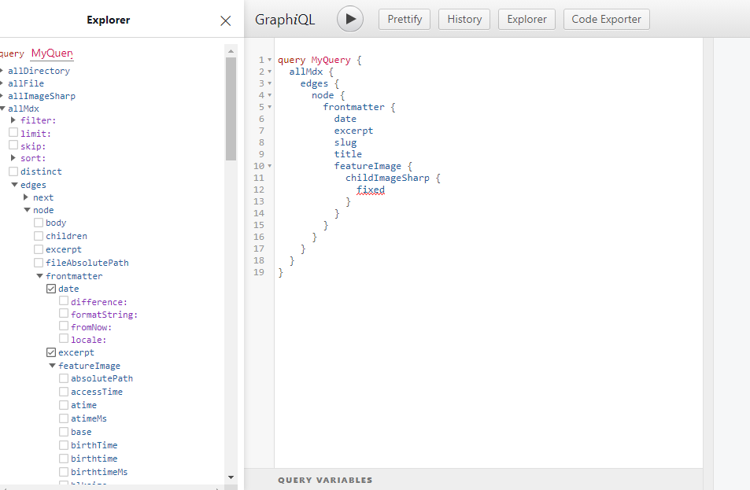

## Preparing Local Environment

- Install NodeJS

> [Link to download Node](https://nodejs.org/en/download/)

- Install git, optional

- Install gatsby cli:

```js
npm install -g gatsby-cli
```

on your command prompt, install:

`command prompt`

```js
gatsby new gatsby-site https://github.com/gatsbyjs/gatsby-starter-hello-world
```

### Installing gatsby plugins and other resources and libraries

- Install gatsby file source:

```js
npm install gatsby-source-filesystem
```

- Gatsby source file system setup:
  - Create a folder at the root of your file and name it " gatsby-config.js" with this code inside it:

`gatsby-config.js`

```js
module.exports = {
  plugins: [
    {
      resolve: `gatsby-source-filesystem`,
      options: {
        name: `pages`,
        path: `${__dirname}/src/pages`,
      },
    },
    {
      resolve: `gatsby-source-filesystem`,
      options: {
        name: `posts`,
        path: `${__dirname}/src/posts`,
      },
    },
    {
      resolve: `gatsby-source-filesystem`,
      options: {
        name: `images`,
        path: `${__dirname}/src/images`,
      },
    },
  ],
}
```

- Create "posts" folder where all the posts will be stored . - - Create "images" folder where all the or some of the images stored.

Install:

```jsx
 npm install gatsby-transformer-sharp gatsby-plugin-sharp
```

- Add "gatsby-transformer-sharp gatsby-plugin-sharp" in the gatsby-config file, and it should look like this code below:

`gatsby-config.js`

```js
module.exports = {
  plugins: [
    {
      //gatsby source filesystem installed
      resolve: `gatsby-source-filesystem`,
      options: {
        name: `pages`,
        path: `${__dirname}/src/pages`,
      },
    },
    {
      resolve: `gatsby-source-filesystem`,
      options: {
        name: `posts`,
        path: `${__dirname}/src/posts`,
      },
    },
    {
      resolve: `gatsby-source-filesystem`,
      options: {
        name: `images`,
        path: `${__dirname}/src/images`,
      },
    },
    //added gatsby-transformer-sharp gatsby-plugin-sharp
    `gatsby-plugin-sharp`,
    `gatsby-transformer-sharp`,
  ],
}
```

- Install following below, for markdown, and for images:

1. Markdown plugin

```jsx
npm install gatsby-plugin-mdx @mdx-js/mdx @mdx-js/react
```

2. Images plugin

```js
npm install gatsby-remark-images
```

- Add both this line of code to your gatsby-config.js file. Check the code below.

`gatsby-config.js`

```js
module.exports = {
  plugins: [
    {
      resolve: `gatsby-source-filesystem`,
      options: {
        name: `pages`,
        path: `${__dirname}/src/pages`,
      },
    },
    {
      resolve: `gatsby-source-filesystem`,
      options: {
        name: `posts`,
        path: `${__dirname}/src/posts`,
      },
    },
    {
      resolve: `gatsby-source-filesystem`,
      options: {
        name: `images`,
        path: `${__dirname}/src/images`,
      },
    },

    `gatsby-plugin-sharp`,
    `gatsby-transformer-sharp`,

    //MDx and Image plugin
    {
      resolve: `gatsby-plugin-mdx`,
      options: {
        extensions: [`.mdx`, `.md`],
        gatsbyRemarkPlugins: [
          {
            resolve: `gatsby-remark-images`,
            options: {
              maxWidth: 1200,
            },
          },
        ],
      },
    },
  ],
}
```

### Installing Google fonts from gatsby plugin

```js
npm install gatsby-plugin-google-fonts
```

- Add the code after the mdx and plugin query.

```js
{
      resolve: `gatsby-plugin-google-fonts`,
      options: {
        fonts: [
          `'Source Code Pro'`,
          `source sans pro\:300,400,400i,700`, // you can also specify font weights and styles
        ],
        display: "swap",
      },
    },
```

### Installing the Frontmatter plugin

- Add a folder called first post and a file name called index.mdx inside it or whatever the folder title you like inside the folder posts.

- add an image of your choice to use. The path should be like this, src-posts-firstpostfolder-index.mdx

- Run the local server.

```js
npm run develop
```

<p>
  If it is successful, you see http://localhost:8000/___graphql. copy that and
  paste it on the browser
</p>

<p>You can now have access to the graphql query site.</p>

- Check the image below for graphql.

<<<<<<< HEAD

=======

>>>>>>> 2d829986549cd13fd3731a3777611853eb134259

<p>
  If you see the graphql image above, your doing fine. We'll use graphql query
  later in this tutorial
</p>

### Install Styled Components for css.

<p>
  This is a CSS in JS where you can have access to it wherever you want to use
  it.
</p>

- Install both styled components and babel plugin at the same time, just copy
  the code below and paste it on your command prompt or VS Code editor

```js
npm install gatsby-plugin-styled-components styled-components babel-plugin-styled-components

```

- Create a folder, and name it "themes" under the SRC or source folder. Inside
  the "themes folder, create a file and name it "theme.js" without "s"

- Put this code inside the theme.js file in later use, or you can creat your
  custom css for your projects

`theme.js`

```css
export default {
  fonts: {
    main: "Source Code Pro, Source Sans Pro",
    code: "Roboto Mono, monospace",
  },

  colors: {
    main1: "hsl(207, 70%, 59%)",
    main2: "hsl(207, 70%, 94%)",
    dark1: "hsl(227, 2%, 12%)",
    dark2: "hsl(227, 2%, 26%)",
    dark3: "hsl(227, 2%, 64%)",
    light1: "hsl(0, 0%, 97%)",
    light2: "hsl(0, 0%, 99%)",
  },

  breakpoints: {
    mobile: "only screen and (max-width: 50rem)",
    tablet: "only screen and (max-width: 65rem)",
  },

  spacings: {
    xxSmall: ".25rem",
    xSmall: ".5rem",
    small: "1rem",
    medium: "2rem",
    large: "3rem",
    xLarge: "4rem",
    xxLarge: "6rem",
  },
  animations: {
    button: "box-shadow 0.3s ease",
    link: "color 0.2s ease",
  },
  shadows: {
    shadow1: "0px 5px 20px rgba(30, 30, 31, 0.05)",
  },
}
```

- Create "gatsby-browser.js" file into the root folder, and then create "gatsby-ssr.js" file also into the root of the project.

- Put this code inside the gatsby-browser.js. All the files inside the gatsby-browser.js should be the same as the gatsby.ssr.js, so we need to copy this to our gatsby-ssr.js also.

- gatsby-browser.js and gatsby-ssr.js code below

`gatsby-browser.js/gatsby-ssr.js`

```js
import React from "react"
import { createGlobalStyle, ThemeProvider } from "styled-components"
import Theme from "./src/themes/theme"

const GlobalStyles = createGlobalStyle`
* {
    box-sizing: border-box;
    margin: 0;
    padding: 0;
<<<<<<< HEAD
}
body, html{
    font-family: ${props => props.theme.fonts.main};
    height: 100%;
    background-color: ${props => props.theme.colors.light1};
}
=======
}
body, html{
    font-family: ${props => props.theme.fonts.main};
    height: 100%;
    background-color: ${props => props.theme.colors.light1};
}
>>>>>>> 2d829986549cd13fd3731a3777611853eb134259
`

export const wrapRootElement = ({ element }) => (
  <ThemeProvider theme={Theme}>
    <GlobalStyles />
    {element}
  </ThemeProvider>
)
)
```

<p>
  I also added the GlobalStyles in the above code, this means that this is the
  global styles/css for the whole application, and can change some of the
  properties in a separate file if we want to change some colors, fonts,
  background, etc. In this project's case we already created a "theme" above, so
  we can access it to any component in our project.
</p>

### Create Pages Gatsby Node

#### "Create pages programmatically"

<p>
  Now is the time we can use our graphql query that I showed you in the above.
</p>

- Again, type: "npm run develop" on your command prompt. If it's successful, click on the link or copy and paste it on your browser;

- Copy the code below and paste it on your query and hit the Play button.

`Graphiql query`

```js
query MyQuery {
  allMdx(sort: {fields: frontmatter___date, order: DESC}) {
    edges {
      node {
        frontmatter {
          slug
        }
        id
      }
    }
  }
}
```

<p>
  When you paste the the code above and played it in the graphiql, it showed you
  what is really happening behind these query that you input. You can check that
  at the right of your query. Note that this is query for creating pages
  programmatically.
</p>
<<<<<<< HEAD

- Create a js file at the root of your project folder and name it "gatsby-node.js". Inside this file paste the code you queried in the graphiql. Your code should look like the code below:

`gatsby-node.js`

=======

- Create a js file at the root of your project folder and name it "gatsby-node.js". Inside this file paste the code you queried in the graphiql. Your code should look like the code below:

`gatsby-node.js`

>>>>>>> 2d829986549cd13fd3731a3777611853eb134259
```js
exports.createPages = async function ({ actions, graphql }) {
  const { data } = await graphql`
    query {
      allMdx(sort: { fields: frontmatter___date, order: DESC }) {
        edges {
          node {
            frontmatter {
              slug
            }
            id
          }
        }
      }
    }
  `
```
<<<<<<< HEAD

### Creating Paginated Pages For Posts

#### to be continued
=======

### Creating Paginated Pages For Posts
>>>>>>> 2d829986549cd13fd3731a3777611853eb134259
