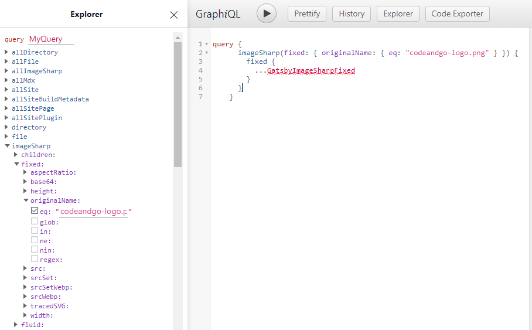

## Preparing Local Environment

- Install NodeJS

> [Link to download Node](https://nodejs.org/en/download/)

- Install git, optional

- Install gatsby cli:

```js
npm install -g gatsby-cli
```

on your command prompt, install:

`command prompt`

```js
gatsby new gatsby-site https://github.com/gatsbyjs/gatsby-starter-hello-world
```

### Installing gatsby plugins and other resources and libraries

- Install gatsby file source:

```js
npm install gatsby-source-filesystem
```

- Gatsby source file system setup:
  - Create a folder at the root of your file and name it " gatsby-config.js" with this code inside it:

`gatsby-config.js`

```js
module.exports = {
  plugins: [
    {
      resolve: `gatsby-source-filesystem`,
      options: {
        name: `pages`,
        path: `${__dirname}/src/pages`,
      },
    },
    {
      resolve: `gatsby-source-filesystem`,
      options: {
        name: `posts`,
        path: `${__dirname}/src/posts`,
      },
    },
    {
      resolve: `gatsby-source-filesystem`,
      options: {
        name: `images`,
        path: `${__dirname}/src/images`,
      },
    },
  ],
}
```

- Create "posts" folder where all the posts will be stored . - - Create "images" folder where all the or some of the images stored.

Install:

```jsx
 npm install gatsby-transformer-sharp gatsby-plugin-sharp
```

- Add "gatsby-transformer-sharp gatsby-plugin-sharp" in the gatsby-config file, and it should look like this code below:

`gatsby-config.js`

```js
module.exports = {
  plugins: [
    {
      //gatsby source filesystem installed
      resolve: `gatsby-source-filesystem`,
      options: {
        name: `pages`,
        path: `${__dirname}/src/pages`,
      },
    },
    {
      resolve: `gatsby-source-filesystem`,
      options: {
        name: `posts`,
        path: `${__dirname}/src/posts`,
      },
    },
    {
      resolve: `gatsby-source-filesystem`,
      options: {
        name: `images`,
        path: `${__dirname}/src/images`,
      },
    },
    //added gatsby-transformer-sharp gatsby-plugin-sharp
    `gatsby-plugin-sharp`,
    `gatsby-transformer-sharp`,
  ],
}
```

- Install following below, for markdown, and for images:

1. Markdown plugin

```jsx
npm install gatsby-plugin-mdx @mdx-js/mdx @mdx-js/react
```

2. Images plugin

```js
npm install gatsby-remark-images
```

- Add both this line of code to your gatsby-config.js file. Check the code below.

`gatsby-config.js`

```js
module.exports = {
  plugins: [
    {
      resolve: `gatsby-source-filesystem`,
      options: {
        name: `pages`,
        path: `${__dirname}/src/pages`,
      },
    },
    {
      resolve: `gatsby-source-filesystem`,
      options: {
        name: `posts`,
        path: `${__dirname}/src/posts`,
      },
    },
    {
      resolve: `gatsby-source-filesystem`,
      options: {
        name: `images`,
        path: `${__dirname}/src/images`,
      },
    },

    `gatsby-plugin-sharp`,
    `gatsby-transformer-sharp`,

    //MDx and Image plugin
    {
      resolve: `gatsby-plugin-mdx`,
      options: {
        extensions: [`.mdx`, `.md`],
        gatsbyRemarkPlugins: [
          {
            resolve: `gatsby-remark-images`,
            options: {
              maxWidth: 1200,
            },
          },
        ],
      },
    },
  ],
}
```

### Installing Google fonts from gatsby plugin

```js
npm install gatsby-plugin-google-fonts
```

- Add the code after the mdx and plugin query.

```js
{
      resolve: `gatsby-plugin-google-fonts`,
      options: {
        fonts: [
          `'Source Code Pro'`,
          `source sans pro\:300,400,400i,700`, // you can also specify font weights and styles
        ],
        display: "swap",
      },
    },
```

### Installing the Frontmatter plugin

- Add a folder called first post and a file name called index.mdx inside it or whatever the folder title you like inside the folder posts.

- add an image of your choice to use. The path should be like this, src-posts-firstpostfolder-index.mdx

- Run the local server.

```js
npm run develop
```

<p>
  If it is successful, you see http://localhost:8000/___graphql. copy that and
  paste it on the browser
</p>

<p>You can now have access to the graphql query site.</p>

- Check the image below for graphql.


<p>
  If you see the graphql image above, your doing fine. We'll use graphql query
  later in this tutorial
</p>

### Install Styled Components for css.

<p>
  This is a CSS in JS where you can have access to it wherever you want to use
  it.
</p>

- Install both styled components and babel plugin at the same time, just copy
  the code below and paste it on your command prompt or VS Code editor

```js
npm install gatsby-plugin-styled-components styled-components babel-plugin-styled-components

```

- Create a folder, and name it "themes" under the SRC or source folder. Inside
  the "themes folder, create a file and name it "theme.js" without "s"

- Put this code inside the theme.js file in later use, or you can creat your
  custom css for your projects

`theme.js`

```css
export default {
  fonts: {
    main: "Source Code Pro, Source Sans Pro",
    code: "Roboto Mono, monospace",
  },

  colors: {
    main1: "hsl(207, 70%, 59%)",
    main2: "hsl(207, 70%, 94%)",
    dark1: "hsl(227, 2%, 12%)",
    dark2: "hsl(227, 2%, 26%)",
    dark3: "hsl(227, 2%, 64%)",
    light1: "hsl(0, 0%, 97%)",
    light2: "hsl(0, 0%, 99%)",
  },

  breakpoints: {
    mobile: "only screen and (max-width: 50rem)",
    tablet: "only screen and (max-width: 65rem)",
  },

  spacings: {
    xxSmall: ".25rem",
    xSmall: ".5rem",
    small: "1rem",
    medium: "2rem",
    large: "3rem",
    xLarge: "4rem",
    xxLarge: "6rem",
  },
  animations: {
    button: "box-shadow 0.3s ease",
    link: "color 0.2s ease",
  },
  shadows: {
    shadow1: "0px 5px 20px rgba(30, 30, 31, 0.05)",
  },
}
```

- Create "gatsby-browser.js" file into the root folder, and then create "gatsby-ssr.js" file also into the root of the project.

- Put this code inside the gatsby-browser.js. All the files inside the gatsby-browser.js should be the same as the gatsby.ssr.js, so we need to copy this to our gatsby-ssr.js also.

- gatsby-browser.js and gatsby-ssr.js code below

`gatsby-browser.js/gatsby-ssr.js`

```js
import React from "react"
import { createGlobalStyle, ThemeProvider } from "styled-components"
import Theme from "./src/themes/theme"

const GlobalStyles = createGlobalStyle`
* {
    box-sizing: border-box;
    margin: 0;
    padding: 0;
}
body, html{
    font-family: ${props => props.theme.fonts.main};
    height: 100%;
    background-color: ${props => props.theme.colors.light1};
}
`

export const wrapRootElement = ({ element }) => (
  <ThemeProvider theme={Theme}>
    <GlobalStyles />
    {element}
  </ThemeProvider>
)
)
```

<p>
  I also added the GlobalStyles in the above code, this means that this is the
  global styles/css for the whole application, and can change some of the
  properties in a separate file if we want to change some colors, fonts,
  background, etc. In this project's case we already created a "theme" above, so
  we can access it to any component in our project.
</p>

### Create Pages Gatsby Node

#### "Create pages programmatically"

<p>
  Now is the time we can use our graphql query that I showed you in the above.
</p>

- Again, type: "npm run develop" on your command prompt. If it's successful, click on the link or copy and paste it on your browser;

- Copy the code below and paste it on your query and hit the Play button.

`Graphiql query`

```js
query MyQuery {
  allMdx(sort: {fields: frontmatter___date, order: DESC}) {
    edges {
      node {
        frontmatter {
          slug
        }
        id
      }
    }
  }
}
```

<p>
  When you paste the the code above and played it in the graphiql, it showed you
  what is really happening behind these query that you input. You can check that
  at the right of your query. Note that this is query for creating pages
  programmatically.
</p>

- Create a js file at the root of your project folder and name it "gatsby-node.js". Inside this file paste the code you queried in the graphiql. Your code should look like the code below:

`gatsby-node.js`

```js
exports.createPages = async function ({ actions, graphql }) {
  const { data } = await graphql`
    query {
      allMdx(sort: { fields: frontmatter___date, order: DESC }) {
        edges {
          node {
            frontmatter {
              slug
            }
            id
          }
        }
      }
    }
  `
```

### Creating Paginated Pages For Posts

<p>
  In this section, we are going to create our paginated pages for our post. The
  code below will be added to "gatsby-node.js" file.
</p>

`Just add this code inside the gatsby-node.js after the above code`

```js
const postPerPage = 3
const numPages = Math.ceil(data.allMdx.edges.length / postPerPage)

Array.from({ length: numPages }).forEach((_, i) => {
  actions.createPages({
    path: i === 0 ? `/` : `/${i + 1}`,
    component: require.resolve("./src/templates/allPost.js"),
    context: {
      limit: postPerPage,
      skip: i * postPerPage,
      numPages,
      currentPage: i + 1,
    },
  })
})
```

- Create a sub-folder "elements" under source folder that will contain elements for every components that we are going to create in the "components" folder later in this lessons.

- Inside the "elements folder" create a file called "ContainerElements.js" or any name you want with the same pattern to avoid confusions, write the code below inside this file:

`ContainerElements.js`

```js
import styled from "styled-components"

export const ContainerWrapper = styled.div`
  height: 100%;
  display: grid;
  grid-template-columns: 1fr repeat(12, minmax(auto, 4.2rem)) 1fr;
  grid-template-rows: 7.8rem 20rem 5rem auto;
  gap: 0 2rem;

  @media ${props => props.theme.breakpoints.tablet} {
    grid-template-columns: 2rem repeat(6, 1fr) 2rem;
    grid-gap: 0 1rem;
  }
  @media ${props => props.theme.breakpoints.mobile} {
    grid-template-columns: 0.5rem repeat(6, 1fr) 0.5rem;
  }

```

- Don't forget to create an index.js so we can export our ContainerElements.js. This should be inside the "elements" folder with the ContainerElements.js.

`index.js`

```js
export * from "./ContainerElements"
```

<p>
  And that is the first export that we have inside our index.js, that means we
  can use any elements inside that file by just importing it directly from the
  subfolder called "elements"
</p>

- Now, create our "components" folder under the SRC folder where we can store every components that we are going to create in this tutorial.

<p>
  Let's start by adding a component called "Container.js", and the "index.js"
  where we can export our Container.js file. This is the same steps when we
  created the ContainerElements.js above.
</p>

- Just copy the code below to our "Container.js file below:

`Container.js`

```js
import React from "react"
import { ContainerWrapper } from "../elements"

export const Container = ({ children }) => {
  return <ContainerWrapper>{children}</ContainerWrapper>
}
```

- Wait, don't forget to export our Container.js in our "index.js" under the "components" folder.

`index.js`

```js
export * from "./Container"
```

`Note that we have already created two index.js with a separate folder. The index.js inside the "elements" folder and the index.js inside the "components" folder.`

<p>
  Notice that the ContainerElements.js and the Container.js are directly
  communicating each other.
</p>

- Instead of typing the complete path like:

```js
import ContainerElements from "./src/elements/ContainerElements"
```

- You can just import it directly like:

```js
import { ContainerWrapper } from "../elements"
```

- Now that we have the ContainerElements.js and the Container.js we can use, we can now import the Container.js to our new index.js which we are going to create inside the "pages" folder.

`NOTE`

<p>
  "pages" folder was automatically generated when we first created our
  "gatsby-starter-hello-world", if you don't see the "pages" folder, create one
  under the "SRC" folder, and inside "pages" folder, again, add an "index.js"
  file.
</p>

`index.js`

```js
import React from "react"
import { Container } from "../components"

const IndexPage = () => {
  return (
    <Container>
      <h1>Hello World From Index Page</h1>
    </Container>
  )
}
export default IndexPage
```

### Navigation Component

<p>
  We are going to repeat the process as we did in the Container.js and the
  ContainerElements.js.
</p>

- Create a file and name it "NavElements.js". This file will also put inside the "elements" folder along with the ContainerElements.js. Type the following code below:

```js
import styled from "styled-components"

export const NavWrapper = styled.nav`
  grid-column: 2 / span 12;
  grid-row: 1 / 2;
  display: flex;
  align-items: center;

  @media ${props => props.theme.breakpoints.tablet} {
    grid-column: 2 / span 6;
  }
`
```

- Don't forget to export it in the "index.js" in the "elements" folder.

`index.js`

```js
export * from "./ContainerElements"
export * from "./NavElements"
```

- We now have two exports in our index.js inside our "elements" folder.

- Head on to our "components" folder and create a file and name it as "Nav.js".

`Nav.js`

```js
import React from "react"
import { useStaticQuery, Link, graphql } from "gatsby"
import { NavWrapper } from "../elements"

export const Nav = () => {
  const data = useStaticQuery(graphql`
    query {
      logo: file(relativePath: { eq: "logo.png" }) {
        publicURL
      }
    }
  `)
  return (
    <NavWrapper>
      <Link to="/">
        
      </Link>
    </NavWrapper>
  )
}
```

- Do not to forget to export "Nav.js" in our index.js under the "components" folder.

`index.js`

```js
export * from "./Container"
export * from "./Nav"
```

- We now have two exports in our index.js inside our "components" folder.

- In the "Nav.js there several steps been made"

  - Imported our NavWrapper directly from our NavElements.js to wrap our navigation.
  - Created images folder under the SRC folder, where we can store our images.
  - Added a our logo.png image for our logo.png from images folder.

  - We named our query as "data"
  - We imported Link, useStaticQuery, and graphql from gatsby

<p>
  We've done the Navigation part, we can now import/add it to our
  "Container.js", we can now pass the Nav inside our Container.
</p>

`Container.js`

```js
import React from "react"
import { ContainerWrapper } from "../elements"
import { Nav } from "../components"

export const Container = ({ children }) => {
  return (
    <ContainerWrapper>
      <Nav />
      {children}
    </ContainerWrapper>
  )
}
```

### The Footer

<p>Let's create our footer elements</p>

- Create a js file and name it "FooterElements.js" in our subfolder "elements" same as the above steps. Inside "FooterElements.js" copy and paste the code below:

`FooterElements.js`

```js
import styled from "styled-components"

export const FooterWrapper = styled.footer`
  grid-column: 2 / span 12;
  min-height: 11.25rem;
  padding: 3rem;
  display: flex;
  justify-content: center;
  align-items: flex-start;

  @media ${props => props.theme.breakpoints.tablet}{
      grid-column 2 / span 6;
  }
`
export const FooterSocialWrapper = styled.div`
  display: flex;
  flex-wrap: wrap;
  align-items: center;
  text-align: center;

  & p {
    text-align: center;
    flex: 0 0 100%;
  }
`
export const FooterSocialIcons = styled.div`
  flex: 0 0 100%;
  margin-bottom: 2rem;

  & img {
    height: 22px;
    padding: 0 1rem;
    transition: filter 0.3s ease;
  }
  & img:hover,
  img:focus {
    height: 24px;
    filter: brightness(60%);
  }
`
```

- Don't forget forget to add an export in the index.js file.

`index.js` in the "elements" folder

```js
export * from "./ContainerElements"
export * from "./NavElements"
export * from "./FooterElements"
```

- Create a file in the "components" folder called "Footer", that's very straight forward. Copy the code below:

`Notice that I already added some Social Icons in the images folder, and this social icons elements was already added inside the "FooterElements.js" called "FooterSocialIcons" and we passes this elements in the "Footer.js in the components folder"`

`Footer.js`

```js
import React from "react"
import { useStaticQuery, graphql } from "gatsby"
import {
  FooterWrapper,
  FooterSocialWrapper,
  FooterSocialIcons,
} from "../elements"

export const Footer = () => {
  const data = useStaticQuery(graphql`
    query {
      facebook: file(relativePath: { eq: "facebook.svg" }) {
        publicURL
      }
      linkedin: file(relativePath: { eq: "linkedin.svg" }) {
        publicURL
      }
      twitter: file(relativePath: { eq: "twitter.svg" }) {
        publicURL
      }
      youtube: file(relativePath: { eq: "youtube.svg" }) {
        publicURL
      }
    }
  `)
  return (
    <FooterWrapper>
      <FooterSocialWrapper>
        <FooterSocialIcons>
          <a
            href="https://facebook.com"
            target="_blank"
            rel="noopener norefferer"
          >
            
          </a>
          <a
            href="https://linkedin.com"
            target="_blank"
            rel="noopener norefferer"
          >
            
          </a>
          <a
            href="https://twitter.com"
            target="_blank"
            rel="noopener norefferer"
          >
            
          </a>
          <a
            href="https://youtube.com"
            target="_blank"
            rel="noopener norefferer"
          >
            
          </a>
        </FooterSocialIcons>
      </FooterSocialWrapper>
    </FooterWrapper>
  )
}
```

- Don't forget to add an export inside the index.js in the "components" folder.

### Responsive Images

`Same steps as the above`

- Add a new file called "ImageElements.js" inside the elements folder, and don't forget add an export in the element's index.js.

<p>Do the same in the components folder.</p>{" "}

- Add a new file called "FeatureImage.js" inside the "components" folder, and don't forget to add an export in the components's index.js.

- Stop your development server and install the image plugin from gatsby.

`Install`

```js
npm i gatsby-image
```

- Again, run your development server. If successful, click the http://localhost:8000/\_\_\_graphql, enter and play the following below.

`Start by selecting imageSharp-fixed-original name-name of the image.`

-please refer to the image below:



- Or, just copy the following code in your "FeatureImage.js" in the components folder:

`FeatureImage.js`

```js
import React from "react"
import Img from "gatsby-image"
import { useStaticQuery, graphql } from "gatsby"
import { FeatureImageWrapper } from "../elements"

export const FeatureImage = ({ fixed }) => {
  const data = useStaticQuery(graphql`
    query {
      imageSharp(fixed: { originalName: { eq: "codeko.jpg" } }) {
        fixed {
          ...GatsbyImageSharpFixed
        }
      }
    }
  `)

  return (
    <FeatureImageWrapper>
      
    </FeatureImageWrapper>
  )
}
```

- add an image in the images folder for this line of code to work. For example in the above query imageSharp(fixed: { originalName: { eq: "codeko.jpg" } })

- Copy the code below to ImageElements.js

`ImageElements.js`

```js
import styled from "styled-components"

export const FeatureImageWrapper = styled.div`
  grid-column: 3 / span 10;
  grid-row: 2 / 4;
  overflow: hidden;
  position: relative;

  @media ${props => props.theme.breakpoints.tablet} grid-column: 2 /span 6;
`
```

### Content Component

- Add the following files to elements folder:

  - CardElements.js
  - ButtonElements.js

- Add the following files to components folder:

  - ContentCard.js
  - Button.js

- Add this code to the following files we created:

`CardElements.js`

```js
import styled from "styled-components"

export const CardWrapper = styled.div`
  margin-top: 2rem;
  padding: 1rem;
  display: flex;
  flex-direction: column;
  align-items: center;
`
```

`ContentCard.js`

```js
import styled from "styled-components"

export const ContentWrapper = styled.main`
  grid-column: 4 / span 8;
  grid-row: 3 / span 5;
  background-color: ${props => props.theme.colors.light2};
  padding: ${props =>
    `${props.theme.spacings.xLarge} ${props.theme.spacings.xxLarge}`};
  box-shadow: ${props => props.theme.shadows.shadow2};
  x-index: 10;

  @media ${props => props.theme.breakpoints.tablet} {
    grid-column: 2 / span 6;
  }

  @media ${props => props.theme.breakpoints.mobile} {
    padding: ${props =>
      `${props.theme.spacings.medium} ${props.theme.spacings.large}`};
  }
`
```

`Button.js`

```js
import React from "react"
import { ButtonWrapper } from "../elements"

export const Button = ({ children, href }) => {
  return <ButtonWrapper to={href}>{children}</ButtonWrapper>
}
```

`ButtonElements.js`

```js
import React from "react"
import styled from "styled-components"
import { Link } from "gatsby"

export const ButtonWrapper = styled(props => <Link {...props} />)`
  padding: 0.5rem 0.75rem;
  background-color: ${props => props.theme.colors.main1};
  border-radius: 0.5rem;
  color: ${props => props.theme.colors.light1};
  font-weight: 700;
  font-size: 0.875rem;
  width: fit-content;
  transition: filter 0.3s ease;
  text-decoration: none;
  &:hover,
  &:focus {
    filter: brightness(110%);
  }
`
```

### Pagination Component

<p>And, as usual we need to create an element for Pagination component.</p>

- Add a file PaginationElements.js in the "elements" folder and add the following code below.

`PaginationElements.js`

```js
import React from "react"
import styled from "styled-components"
import { Link } from "gatsby"

export const PaginationWrapper = styled.div`
  grid-column: 2 / span 12;
  padding: 3rem 0;
  display: flex;
  align-items: center;
  justify-content: center;

  a:nth-child(1) {
    color: ${props =>
      props.isFirst ? props.theme.colors.dark3 : props.theme.colors.dark1};
    ponter-events: ${props => (props.isFirst ? "none" : "auto")};

    cursor: ${props => (props.isFirst ? "default" : "pointer")};
  }

  a:nth-child(2) {
    color: ${props =>
      props.isLast ? props.theme.colors.dark3 : props.theme.colors.dark1};
    ponter-events: ${props => (props.isLast ? "none" : "auto")};

    cursor: ${props => (props.isLast ? "default" : "pointer")};
  }

  @media ${props => props.theme.breakpoints.tablet} {
    grid-column: 2 / span 6;
  }
`
export const PaginationElement = styled(props => <Link {...props} />)`
  font-size: 0.875rem;
  line-height: 1.125rem;
  font-weight: 400;
  text-decoration: none;
  margin: 0 2rem;

  &:hover,
  &focus {
    text-decoration: underline;
  }
`
```

- Add export in the index.js

- For our Pagination component

`Pagination.js`

```js
import React from "react"
import { PaginationWrapper, PaginationElements } from "../elements"

export const Pagination = ({ isFirst, isLast, prevPage, nextPage }) => {
  return (
    <PaginationWrapper isFirst={isFirst} isLast={isLast}>
      <PaginationElements to={prevPage}>Previous Page</PaginationElements>
      <PaginationElements to={nextPage}>Next Page</PaginationElements>
    </PaginationWrapper>
  )
}
```

- Add export in the index.js

### Pagination Pages Template

- Create a sub-folder "template" in our SRC folder

- Add a file "allPosts.js" inside the "template" folder.

- No need to add export in the index file.

- Played a query in our graphiql, if you want to see the output for this query, go ahead and copy the file below and run it on your graphiql.

```js
allMdx(
      sort: { fields: frontmatter___date, order: DESC }
      skip: $skip //changed it from 3 to $$skip
      limit: $limit //change it from 3 to variable $limit
    ) {
      edges {
        node {
          frontmatter {
            slug
            title
            date(formatString: "MMMM DD, YYYY")
            excerpt
          }
        }
      }
    }
  }
`
```

<p>Your entire code inside "allPosts.js" should look like this:</p>

```js
import React from "react"
import { graphql } from "gatsby"

import {
  Container,
  Content,
  ContentCard,
  FeatureImage,
  Pagination,
} from "../components"
import { H1, P } from "../elements"

const allPosts = ({ pageContext, data }) => {
  const { currentPage, numPages } = pageContext
  const isFirst = currentPage === 1
  const isLast = currentPage === numPages
  const prevPage = currentPage - 1 === 1 ? "/" : `/${currentPage - 1}`
  const nextPage = `/${currentPage + 1}`
  const posts = data.allMdx.edges

  return (
    <Container>
      <FeatureImage />
      <Content>
        <H1 textAlign="center" margin="0 0 1rem 0">
          Become a better javascript developer
        </H1>
        <P color="dark2" textAlign="center">
          THIS IS MY WAY OF LEARNING NEW STUFF ABOUT WEB DEVELOPMENT. WIRITNG A
          BLOGPOSTS.
        </P>
        {posts.map(post => (
          <ContentCard
            key={post.node.frontmatter.slug}
            date={post.node.frontmatter.date}
            title={post.node.frontmatter.title}
            excerpt={post.node.frontmatter.excerpt}
            slug={post.node.frontmatter.slug}
          />
        ))}
      </Content>

      <Pagination
        isFirst={isFirst}
        isLast={isLast}
        prevPage={prevPage}
        nextPage={nextPage}
      />
    </Container>
  )
}
export default allPosts

export const pageQuery = graphql`
  query AllPostsQuery($skip: Int!, $limit: Int!) {
    allMdx(
      sort: { fields: frontmatter___date, order: DESC }
      skip: $skip
      limit: $limit
    ) {
      edges {
        node {
          frontmatter {
            slug
            title
            date(formatString: "MMMM DD, YYYY")
            excerpt
          }
        }
      }
    }
  }
`
```

### Individual Post Components

- Add a file in the "elements" folder and name it "PostElements.js"

- Never forget to add export in your index.js

- Copy this code below:

`PostElements.js`

```js
import styled from "styled-components"

export const ContentWrapper = styled.main`
  grid-column: 4 / span 8;
  grid-row: 4 / span 6;
  background-color: ${props => props.theme.colors.light2};
  padding: ${props =>
    `${props.theme.spacings.xLarge} ${props.theme.spacings.xxLarge}`};
  box-shadow: ${props => props.theme.shadows.shadow1};
  x-index: 10;

  @media ${props => props.theme.breakpoints.tablet} {
    grid-column: 2 / span 6;
  }

  @media ${props => props.theme.breakpoints.mobile} {
    padding: ${props =>
      `${props.theme.spacings.medium} ${props.theme.spacings.large}`};
  }
`
```

`Post.js`

```js
import { PostWrapper } from "../elements"

export const Post = ({ children }) => {
  return <PostWrapper>{children}</PostWrapper>
}
```

- Never forget to add export to your index.js

### SinglePost Template For Individual Post

- In your gatsby-node.js file, add these line of code.

```js
  //Create single blogposts
  data.allMdx.edges.forEach(edge => {
    const slug = edge.node.frontmatter.slug
    const id = edge.node.id
    actions.createPage({
      path: slug,
      component: require.resolve(`./src/templates/singlePost.js`),
      context: { id },
    })
  }
```

<p>Your entire gatsby-node.js file should look like this</p>

```js
exports.createPages = async function ({ actions, graphql }) {
  const { data } = await graphql(`
    query {
      allMdx(sort: { fields: frontmatter___date, order: DESC }) {
        edges {
          node {
            frontmatter {
              slug
            }
            id
          }
        }
      }
    }
  `)

  //Create paginated pages for posts

  const postPerPage = 3
  const numPages = Math.ceil(data.allMdx.edges.length / postPerPage)

  Array.from({ length: numPages }).forEach((_, i) => {
    actions.createPage({
      path: i === 0 ? `/` : `/${i + 1}`,
      component: require.resolve("./src/templates/allPosts.js"),
      context: {
        limit: postPerPage,
        skip: i * postPerPage,
        numPages,
        currentPage: i + 1,
      },
    })
  })

  //Create single blogposts
  data.allMdx.edges.forEach(edge => {
    const slug = edge.node.frontmatter.slug
    const id = edge.node.id
    actions.createPage({
      path: slug,
      component: require.resolve(`./src/templates/singlePost.js`),
      context: { id },
    })
  })
}
```

- Create another file inside the template folder and name it "singlePost.js"

- Install a plugin from the Gatsby plugin:

```js
npm install gatsby-plugin-mdx @mdx-js/mdx @mdx-js/react
```

- Inside the singlePost.js

`singlePost.js`

```js
import React from "react"
import { graphql } from "gatsby"
import { MDXRenderer } from "gatsby-plugin-mdx"
import { H1 } from "../elements"
import { Container, Post, FeatureImage } from "../components"

const singlePost = ({ data }) => {
  const featureImage = data.mdx.frontmatter.featureImage.childImageSharp.fixed

  return (
    <Container>
      <FeatureImage fixed={featureImage} />
      <Post>
        <H1 margin="0 0 2rem 0">{data.mdx.frontmatter.title}</H1>
        <MDXRenderer>{data.mdx.body}</MDXRenderer>
      </Post>
    </Container>
  )
}

export default singlePost

export const pageQuery = graphql`
  query SinglePostQuery($id: String!) {
    mdx(id: { eq: $id }) {
      body
      frontmatter {
        date
        excerpt
        slug
        title
        featureImage {
          childImageSharp {
            fixed {
              ...GatsbyImageSharpFixed
            }
          }
        }
      }
    }
  }
`
```

### Markdown Styles

- Create a sub-folder "posts" with s under the Src folder

- Create a files inside the posts folder and name it "first-post.mdx", second-post.mdx and so on.

- Inside the .mdx file let say "first-post.mdx"

`first-post.mdx`

```js
---
title: My fourth post
slug: my-fourth-post
date: 2020-03-24
featureImage: nature-fourth-post.jpg
excerpt: It’s been a while since I started web development. In this article, I will explain how I started coding, from making a single basic component to complex components, breaking complex code into a single piece of components to render a single file into the browser and other stuff.
---

# Heading 1

## Heading 2

### Heading 3

#### Heading 4

##### Heading 5

###### Heading 6

**THIS IS BOLD because of the two asterisk on both side**

1. First item
2. Second item
3. Third item

- First item
- Second item
- Third item

  Here's a sentence with a footnote. [^1]

[^1]: This is the footnote.

```

> [Check the markdownguide here](https://www.markdownguide.org/basic-syntax/)

- Go to your gatsby-browser.js

- Your code should look like this:

```js
import React from "react"
import { createGlobalStyle, ThemeProvider } from "styled-components"
import { MDXProvider } from "@mdx-js/react"
import Theme from "./src/themes/theme"

const GlobalStyles = createGlobalStyle`
* {
    box-sizing: border-box;
    margin: 0;
    padding: 0;
}
body, html{
    font-family: ${props => props.theme.fonts.main};
    height: 100%;
    background-color: ${props => props.theme.colors.light1};
}
`

export const wrapRootElement = ({ element }) => (
  //for MDXProvider
  <MDXProvider components={components}>
    <ThemeProvider theme={Theme}>
      <GlobalStyles />
      {element}
    </ThemeProvider>
  </MDXProvider>
)
```

`NOTE`

- Copy all the file from gatsby-browser.js and paste it in the gatsby-ssr.js.

### Syntax Highlighter

<p>
  This is the part where we create a code for our syntax highlighter. If you are
  able to copy the code that is shown in this blog that means, this blog uses a
  syntac highlighting where it can show the code that you want to show on your
  blog post.
</p>

- Install

```js
npm i prism-react-renderer mdx-utils
```

- Add a file inside the components folder and name it "Code.js"

- Don't forget to add export in the index.js

- Inside the Code.js

`Code.js`

```js
import React from "react"
import Highlight, { defaultProps } from "prism-react-renderer"
import theme from "prism-react-renderer/themes/vsDark"

export const Code = ({ codeString, language, ...props }) => {
  return (
    <Highlight
      {...defaultProps}
      theme={theme}
      code={codeString}
      language={language}
    >
      {({ className, style, tokens, getLineProps, getTokenProps }) => (
        <div className="gatsby-highlight" data-language={language}>
          <pre className={className} style={style}>
            {tokens.map((line, i) => (
              <div {...getLineProps({ line, key: i })}>
                {line.map((token, key) => (
                  <span {...getTokenProps({ token, key })} />
                ))}
              </div>
            ))}
          </pre>
        </div>
      )}
    </Highlight>
  )
}
```

- We need to create a separate CSS file at the root of our application folder for our Code.js syntax hightlighting styles.

This css code for syntax hightlighting was copied from lekoarts blog

> [Check the blog here](https://www.lekoarts.de/en/blog/adding-line-numbers-and-code-highlighting-to-mdx-code-blocks)

`language-tab.css`

```css
html,
body {
  margin: 0;
  padding: 0;
}

html {
  font-family: sans-serif;
  -ms-text-size-adjust: 100%;
  -webkit-text-size-adjust: 100%;
}

.prism-code {
  font-size: 1rem;
  padding-top: 1rem;
  padding-bottom: 1rem;
  -webkit-overflow-scrolling: touch;
  background-color: transparent;
  overflow: initial;
}

.token {
  display: inline-block;
}

p > code,
li > code {
  background: rgb(1, 22, 39);
  color: rgb(214, 222, 235);
  padding: 0.4em 0.3rem;
}

.gatsby-highlight {
  font-size: 1rem;
  position: relative;
  -webkit-overflow-scrolling: touch;
  overflow: auto;
}

gatsby-highlight > code[class*="language-"],
.gatsby-highlight > pre[class*="language-"] {
  word-spacing: normal;
  word-break: normal;
  overflow-wrap: normal;
  line-height: 1.5;
  tab-size: 4;
  hyphens: none;
}

.line-number-style {
  display: inline-block;
  padding-left: 1em;
  padding-right: 1em;
  width: 1.2em;
  user-select: none;
  opacity: 0.3;
  text-align: center;
  position: relative;
}

.highlight-line {
  background-color: rgb(2, 55, 81);
  border-left: 4px solid rgb(2, 155, 206);
}

.highlight-line .line-number-style {
  opacity: 0.5;
  width: calc(1.2em - 4px);
  left: -2px;
}
```

- Modify your gatsby-browser.js and gatsby-ssr.js code below:

`gatsby-browser.js and gatsby-ssr.js`

```js
import React from "react"
import { createGlobalStyle, ThemeProvider } from "styled-components"
import { MDXProvider } from "@mdx-js/react"
import { preToCodeBlock } from "mdx-utils"
import Theme from "./src/themes/theme"
import { Code } from "./src/components"
import "./language-tabs.css"

const GlobalStyles = createGlobalStyle`
* {
    box-sizing: border-box;
    margin: 0;
    padding: 0;
}
body, html{
    font-family: ${props => props.theme.fonts.main};
    height: 100%;
    background-color: ${props => props.theme.colors.light1};
}
`

const components = {
  pre: preProps => {
    const props = preToCodeBlock(preProps)
    if (props) {
      return <Code {...props} />
    }
    return <pre {...preProps} />
  },
  wrapper: ({ children }) => <>{children}</>,
}

export const wrapRootElement = ({ element }) => (
  //for MDXProvider
  <MDXProvider components={components}>
    <ThemeProvider theme={Theme}>
      <GlobalStyles />
      {element}
    </ThemeProvider>
  </MDXProvider>
)
```

### 404

- Create a file at the root of your application folder and name it "404.js"

- Inside the 404.js:

```js
import React from "react"
import { graphql } from "gatsby"
import { Container, Content, FeatureImage } from "../components"
import { H1 } from "../elements"

const notFound = ({ data }) => {
  const featureImage = data.imageSharp.fixed
  return (
    <Container>
      <FeatureImage fixed={featureImage} />
      <Content>
        <H1 textAlign="center" margin="0 0 1rem 0">
          Uh oh.. Cannot be found.{" "}
        </H1>
      </Content>
    </Container>
  )
}

export default notFound

export const notFoundQuery = graphql`
  query NotFoundQuery {
    imageSharp(fixed: { originalName: { eq: "logo.png" } }) {
      fixed {
        ...GatsbyImageSharpFixed
      }
    }
  }
`
```

### SEO Component

- Add a file and name it Seo.js.
- Don't forget to add export in the index.js
- Install the React Helmet first

```js
npm i react-helmet
```

- Add the following code below:

`Seo.js`

```js
import React from "react"
import { Helmet } from "react-helmet"
import { StaticQuery, graphql } from "gatsby"

export const Seo = ({ description, keywords, title, image, url, author }) => {
  return (
    <StaticQuery
      query={detailsQuery}
      render={data => {
        const metaDescription = description || data.site.siteMetadata.desription
        const metaTitle = title || data.site.siteMetadata.title
        const metaAuthor = author || data.site.siteMetadata.author
        const metaUrl = url || data.site.siteMetadata.url
        const metaImage = image || data.site.siteMetadata.image
        const metaKeywords = keywords || [
          "code syntax",
          "codeandgo courses",
          "code and go web development",
        ]
        return (
          <Helmet
            title={title}
            meta={[
              {
                name: `description`,
                content: metaDescription,
              },
              {
                property: `og:title`,
                content: metaTitle,
              },
              {
                property: `og:description`,
                content: metaDescription,
              },

              {
                property: `og:type`,
                content: `website`,
              },
              {
                property: `og:image`,
                content: metaImage,
              },

              {
                property: `og:url`,
                content: metaUrl,
              },
              {
                name: `twitter:card`,
                content: `summary_large_image`,
              },
              {
                name: `twitter:creator`,
                content: metaAuthor,
              },
              {
                name: `twitter:title`,
                content: metaTitle,
              },
              {
                name: `twitter: description`,
                content: metaDescription,
              },
              {
                name: `twitter:image`,
                content: metaImage,
              },
            ].concat(
              metaKeywords && metaKeywords.lenght > 0
                ? {
                    name: `keywords`,
                    content: metaKeywords.join(`, `),
                  }
                : []
            )}
          />
        )
      }}
    />
  )
}
const detailsQuery = graphql`
  query DefaultSEOQuery {
    site {
      siteMetadata {
        title
        description
        author
        image
      }
    }
  }
`
```

- Modify the following js file for Seo

`singlePost.js`

```js
import React from "react"
import { graphql } from "gatsby"
import { MDXRenderer } from "gatsby-plugin-mdx"
import { H1 } from "../elements"
import { Container, Post, FeatureImage, Seo } from "../components"

const singlePost = ({ data }) => {
  const featureImage = data.mdx.frontmatter.featureImage.childImageSharp.fixed

  //SEO DOWN
  const seoImage = data.mdx.frontmatter.featureImage.publicURL

  return (
    <Container>
      <Seo
        title={data.mdx.frontmater.title}
        image={seoImage}
        description={data.mdx.frontmatter.excerpt}
      />
      {/* SEO */}
      <FeatureImage fixed={featureImage} />
      <Post>
        <H1 margin="0 0 2rem 0">{data.mdx.frontmatter.title}</H1>
        <MDXRenderer>{data.mdx.body}</MDXRenderer>
      </Post>
    </Container>
  )
}

export default singlePost

export const pageQuery = graphql`
  query SinglePostQuery($id: String!) {
    mdx(id: { eq: $id }) {
      body
      frontmatter {
        date
        excerpt
        slug
        title
        featureImage {
          publicURL
          childImageSharp {
            fixed {
              ...GatsbyImageSharpFixed
            }
          }
        }
      }
    }
  }
`
```

`allPost.js`

```js
import React from "react"
import { graphql } from "gatsby"

import {
  Container,
  Content,
  ContentCard,
  FeatureImage,
  Pagination,
  Seo,
} from "../components"
import { H1, P } from "../elements"

const allPosts = ({ pageContext, data }) => {
  const { currentPage, numPages } = pageContext
  const isFirst = currentPage === 1
  const isLast = currentPage === numPages
  const prevPage = currentPage - 1 === 1 ? "/" : `/${currentPage - 1}`
  const nextPage = `/${currentPage + 1}`
  const posts = data.allMdx.edges

  return (
    <Container>
      <Seo />
      <FeatureImage />
      <Content>
        <H1 textAlign="center" margin="0 0 1rem 0">
          Become a better javascript developer
        </H1>
        <P color="dark2" textAlign="center">
          THIS IS MY WAY OF LEARNING NEW STUFF ABOUT WEB DEVELOPMENT. WIRITNG A
          BLOGPOSTS.
        </P>
        {posts.map(post => (
          <ContentCard
            key={post.node.frontmatter.slug}
            date={post.node.frontmatter.date}
            title={post.node.frontmatter.title}
            excerpt={post.node.frontmatter.excerpt}
            slug={post.node.frontmatter.slug}
          />
        ))}
      </Content>

      <Pagination
        isFirst={isFirst}
        isLast={isLast}
        prevPage={prevPage}
        nextPage={nextPage}
      />
    </Container>
  )
}
export default allPosts

export const pageQuery = graphql`
  query AllPostsQuery($skip: Int!, $limit: Int!) {
    allMdx(
      sort: { fields: frontmatter___date, order: DESC }
      skip: $skip
      limit: $limit
    ) {
      edges {
        node {
          frontmatter {
            slug
            title
            date(formatString: "MMMM DD, YYYY")
            excerpt
          }
        }
      }
    }
  }
`
```

### Deploying To Netlify

`Created new REPO on Github`

- select without README or non of the check box ticked
- click create REPO
- follow the INSTRUCTIONS.
- iT is important to GIT INIT first before commiting
- Followe the first block of instructions
- after the succesful push for the first commit

`next pushing should be`

- git add .
- git commit -m "comments here"
- git push origin main (master has been removed to get rid of slavery)
- Please check my blog on how to deploy your web application to Netlify

## That's all folks!
